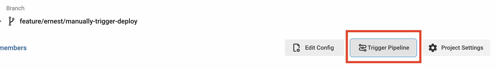

안녕하세요! 요즘에는 Sendbird Chat 배포 자동화를 수정하고 있습니다.
기존에는 `Jira 티켓 생성 -> PM 승인 -> 빌드 -> 배포` 전체 프로세스를 자동화로 관리하고 있었는데요.
4단계의 과정에서 에러가 끼어들면 전체 프로세스를 다시 시작해야하는 번거로움이 있었습니다.
그리고 `master` 브랜치에 `tag`가 만들어지는 것을 트리거로 배포 배포 프로세스가 작동시켰는데,
배포 과정에서 에러가 발생하면 `tag`를 삭제하고 `release` 브랜치를 다시 만들어야하는 어려움이 있었습니다.

## 목표

- `빌드 -> 배포` workflow만 분리하기
- `release` 브랜치에서 위의 workflow 트리거할 수 있게 해주자

## 원하는 때에 CircleCI Workflow 실행시키기

일단은 CircleCI Job을 매뉴얼하게 시작시키는 방법을 알아보겠습니다.
제일 원시적으로 CircleCI에 들어가서 버튼을 누르면 배포가 실행되게 할까 했는데, 생각보다 매뉴얼하게 실행하는게 귀찮습니다.
[How to trigger a workflow via CircleCI API v2](https://support.circleci.com/hc/en-us/articles/360050351292-How-to-trigger-a-workflow-via-CircleCI-API-v2)
글을 보면 어떻게 매뉴얼하게 pipeline을 실행시키는지 알 수 있습니다. 
`config.yml` 파일의 상단에 파라미터를 세팅할 수 있고, 그 파라미터가 true 인지 조건을 걸어두는 방법입니다. 
솔직히 이것도 귀찮긴 하지만... 다른 방법을 못찾았어요.

```yml
parameters:
  run_workflow_build_and_release:
    default: false
    type: boolean
```

```yml
workflows:
  version: 2
  build:
    when: << pipeline.parameters.run_workflow_build_and_release >>
    jobs:
      - job_a
```

(when 으로 조건 설정해뒀는데, condition에 대해 더 살펴보실 분은 [Conditional steps in jobs and conditional workflows
](https://support.circleci.com/hc/en-us/articles/360043638052-Conditional-steps-in-jobs-and-conditional-workflows) 추천 드립니다.)

혹시나 기존 다른 workflow는 실행하고 싶지 않다! 하면 아래와 같이 not으로 조건 추가할 수도 있습니다.

```yml
build-and-test-swift:
when:
    or:
    - not: << pipeline.parameters.run_workflow_build_and_release >>
```

이렇게 `config.yml` 파일을 수정해놓고 CircleCI에 `작업 프로젝트 > 작업 브랜치`로 들어가보면 
`Trigger Pipline` 이라는 버튼을 볼 수 있습니다. 



Trigger Pipline을 누르면 어떤 파라미터를 넣어서 Pipeline을 시작할지 설정할 수 있습니다.
하지만 `run_workflow_build_and_release` 대략 이런식으로 생긴 파라미터를 직접 넣어야하는
상당한 불편함이 있습니다...


## CircleCI API 통해서 Workflow 실행시키기

[Trigger a new pipeline](https://circleci.com/docs/api/v2/#operation/listPipelinesForProject) 여기를 보면 
API를 통해서 pipeline을 트리거할 수 있습니다. 
여기에 파라미터를 추가하면 원하는 workflow만 실행시킬 수 있는 것이죠...!
이쯤되서 말씀드리면 제가 생각하는 큰 그림은 `Github Comment 추가 -> Github Action 발동 -> Circle API 실행 -> 배포 자동화 실행` 입니다. 

위의 사이트로 들어가보면 `Shell+Curl` 에서 어떻게 구성하면 되는지 예시가 나와 있습니다.
저에게 맞는 방식으로 약간 수정해보면 다음과 같습니다.

```bash
curl --request POST \
  --url https://circleci.com/api/v2/project/gh/org-name/repo-name/pipeline \
  --header 'Circle-Token: CIRCLE_CI_TOKEN' \
  --header 'content-type: application/json' \
  --data '{"branch":"release/4.0.0","parameters":{"run_workflow_build_and_release":true}}'
```

`CIRCLE_CI_TOKEN`에는 [Personal API Token](https://circleci.com/docs/2.0/managing-api-tokens/#creating-a-personal-api-token)을 전달해줘야 합니다.
그러면 아래와 같이 response가 넘어오고 pipeline이 실행된 것을 확인할 수 있습니다.

```bash
{
  "number" : 1234,
  "state" : "pending",
  "id" : "abcdefgh-39e8-1ab2-abcd-a385abcdefgh",
  "created_at" : "2022-06-09T14:26:39.437Z"
}
```


## CircleCI API를 Github Comment로 작동시키기


