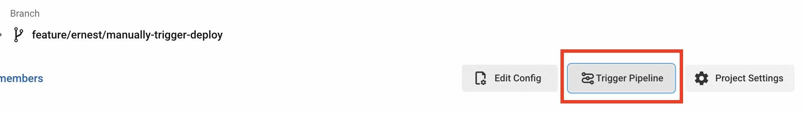
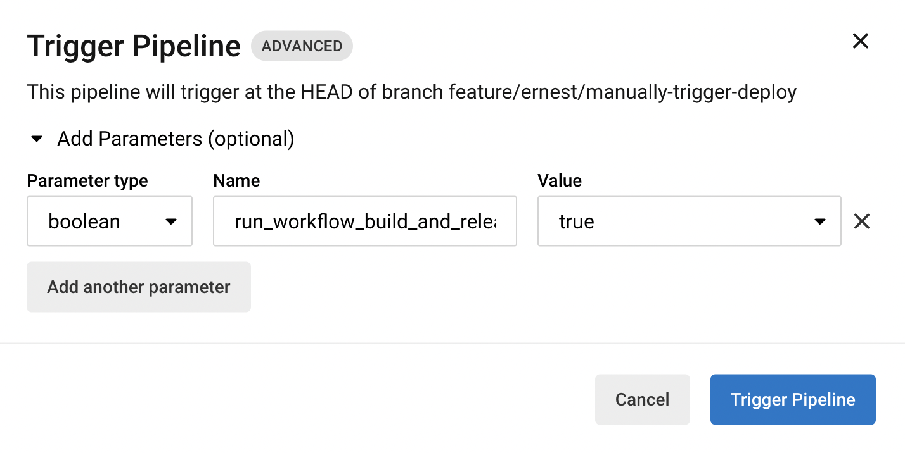
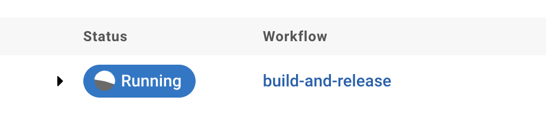
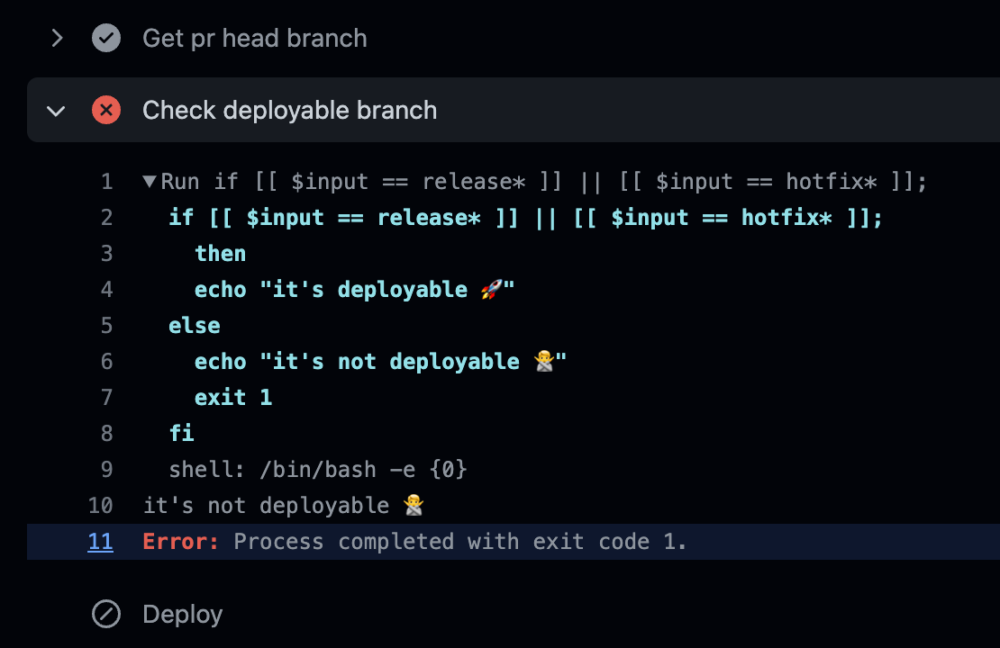
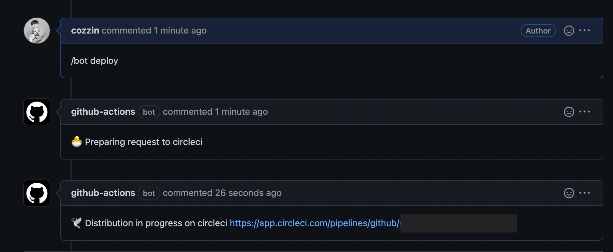

안녕하세요! 요즘에는 Sendbird Chat 배포 자동화를 수정하고 있습니다.
기존에는 `Jira 티켓 생성 -> PM 승인 -> 빌드 -> 배포` 전체 프로세스를 자동화로 관리하고 있었는데요.
4단계의 과정에서 에러가 끼어들면 전체 프로세스를 다시 시작해야하는 번거로움이 있었습니다.
그리고 `master` 브랜치에 `tag`가 만들어지는 것을 트리거로 배포 배포 프로세스가 작동시켰는데,
배포 과정에서 에러가 발생하면 `tag`를 삭제하고 `release` 브랜치를 다시 만들어야하는 어려움이 있었습니다.

## 목표

- `빌드 -> 배포` workflow만 분리하기
- `release` 브랜치에서 위의 workflow 트리거할 수 있게 해주자

##  원하는 때에 CircleCI Workflow 실행시키기

일단은 CircleCI Job을 매뉴얼하게 시작시키는 방법을 알아보겠습니다.
제일 원시적으로 CircleCI에 들어가서 버튼을 누르면 배포가 실행되게 할까 했는데, 생각보다 매뉴얼하게 실행하는게 귀찮습니다.
[How to trigger a workflow via CircleCI API v2](https://support.circleci.com/hc/en-us/articles/360050351292-How-to-trigger-a-workflow-via-CircleCI-API-v2)
글을 보면 어떻게 매뉴얼하게 pipeline을 실행시키는지 알 수 있습니다. 
`config.yml` 파일의 상단에 파라미터를 세팅할 수 있고, 그 파라미터가 true 인지 조건을 걸어두는 방법입니다. 
솔직히 이것도 귀찮긴 하지만... 다른 방법을 못찾았어요.

```yml
parameters:
  run_workflow_build_and_release:
    default: false
    type: boolean
```

```yml
workflows:
  version: 2
  build:
    when: << pipeline.parameters.run_workflow_build_and_release >>
    jobs:
      - job_a
```

(when 으로 조건 설정해뒀는데, condition에 대해 더 살펴보실 분은 [Conditional steps in jobs and conditional workflows
](https://support.circleci.com/hc/en-us/articles/360043638052-Conditional-steps-in-jobs-and-conditional-workflows) 추천 드립니다.)

혹시나 기존 다른 workflow는 실행하고 싶지 않다! 하면 아래와 같이 not으로 조건 추가할 수도 있습니다.

```yml
build-and-test-swift:
when:
    or:
    - not: << pipeline.parameters.run_workflow_build_and_release >>
```

이렇게 `config.yml` 파일을 수정해놓고 CircleCI에 `작업 프로젝트 > 작업 브랜치`로 들어가보면 
`Trigger Pipline` 이라는 버튼을 볼 수 있습니다. 



Trigger Pipline을 누르면 어떤 파라미터를 넣어서 Pipeline을 시작할지 설정할 수 있습니다.
하지만 `run_workflow_build_and_release` 대략 이런식으로 생긴 파라미터를 직접 넣어야하는
상당한 불편함이 있습니다...



## CircleCI API 통해서 Workflow 실행시키기

[Trigger a new pipeline](https://circleci.com/docs/api/v2/#operation/listPipelinesForProject) 여기를 보면 
API를 통해서 pipeline을 트리거할 수 있습니다. 
여기에 파라미터를 추가하면 원하는 workflow만 실행시킬 수 있는 것이죠...!
이쯤되서 말씀드리면 제가 생각하는 큰 그림은 `Github Comment 추가 -> Github Action 발동 -> Circle API 실행 -> 배포 자동화 실행` 입니다. 

위의 사이트로 들어가보면 `Shell+Curl` 에서 어떻게 구성하면 되는지 예시가 나와 있습니다.
저에게 맞는 방식으로 약간 수정해보면 다음과 같습니다.

```bash
curl --request POST \
  --url https://circleci.com/api/v2/project/gh/org-name/repo-name/pipeline \
  --header 'Circle-Token: CIRCLE_CI_TOKEN' \
  --header 'content-type: application/json' \
  --data '{"branch":"release/4.0.0","parameters":{"run_workflow_build_and_release":true}}'
```

`CIRCLE_CI_TOKEN`에는 [Personal API Token](https://circleci.com/docs/2.0/managing-api-tokens/#creating-a-personal-api-token)을 전달해줘야 합니다.
그러면 아래와 같이 response가 넘어오고 pipeline이 실행된 것을 확인할 수 있습니다.

```bash
{
  "number" : 1234,
  "state" : "pending",
  "id" : "abcdefgh-39e8-1ab2-abcd-a385abcdefgh",
  "created_at" : "2022-06-09T14:26:39.437Z"
}
```



## CircleCI API를 Github Comment로 작동시키기

### PR의 브랜치 정보 가져오기

매번 CircleCI 들어가서 파라미터 넣어주기가 너무 귀찮으니까, 
github pr에 comment로 명령어를 날리면 CircleCI API가 실행되도록 해보겠습니다.
`예약어가 담긴 Comment 추가 -> Github Action 실행` 하는 방법을 자세히 알고 싶은 분은 [github action으로 comment bot 만들기](https://medium.com/@hongseongho/github-action%EC%9C%BC%EB%A1%9C-comment-bot-%EB%A7%8C%EB%93%A4%EA%B8%B0-422e6e471c8e) 글을 참고하시면 됩니다.

`.github/workflows` 아래에 다음과 같은 `pr-comment-bot.yml` 파일을 만들었습니다.
유형이 pr이고, 코멘트에 `/bot deploy`가 있을 때 배포되는 조건입니다.
workflow로 브랜치 정보가 들어올테니 코멘트에서 따로 브랜치 입력할 필요가 없습니다! 

```yml
name: PR Comment Bot
on:
  issue_comment:
    types: [created, edited]

jobs:
  pull_request_comment:
    if: | 
      contains(github.event.comment.html_url, '/pull/')
        && contains(github.event.comment.body, '/bot deploy')
    runs-on: [macos-latest]
    steps:
      - name: Deploy
        id: deploy-circle-ci
        run: |
          echo ${{ github.ref_name }}
          DEPLOY_API_RESULT=$(curl --request POST --url https://circleci.com/api/v2/project/gh/organization-name/repository-name/pipeline --header 'Circle-Token: ${{secrets.CIRCLE_CI_API_TOKEN}}' --header 'content-type: application/json' --data '{"branch":${{ github.ref_name }},"parameters":{"run_workflow_build_and_release":true}}')
          echo "DEPLOY_API_RESULT: ${DEPLOY_API_RESULT}"
```

이렇게 깔끔하게 사용하고 싶었는데... `github.base_ref`, `github.ref_name`가 빈 값으로 들어오네요ㅠ 
github json으로 들어오는걸 dump 떠보면 좋을 것 같은데요. 이렇게 하면 json 내용이 다 보입니다.

```yml
jobs:
  print_variables:
    runs-on: [macos-latest]
    steps:
      - name: Dump GitHub context
        env:
          GITHUB_CONTEXT: ${{ toJson(github) }}
        run: echo "$GITHUB_CONTEXT"
```

```json
{
  "token": "***",
  "job": "print_variables",
  "ref": "refs/heads/main",
  "sha": "5cb8257ec0b8fd************************",
  "repository": "repository",
  "repository_owner": "repository_owner",
  "repository_owner_id": "repository_owner_id",
  "repositoryUrl": "git://github.com/organization_name/repository_name.git",
  "run_id": "247965****",
  "repository_id": "43168****",
  "actor_id": "1164****",
  "actor": "cozzin",
  "workflow": "PR Comment Bot",
  "head_ref": "", // 이게 비어 있음...
  "base_ref": "", // 이게 비어 있음...
  "event_name": "issue_comment",
  "event": {
    "issue": {
      "body": "PR Body!",
      "number": 2, // 이걸 활용할 수 있지 않을까?
    }
  }
}
```

`head_ref`, `base_ref`는 비어 있는게 명확하게 확인되었고, 
아마도 comment created로 접근하면 이 내용이 없는 것 같습니다.
`github.event.issue.number`를 활용해보겠습니다. 
`gh`는 github cli 명령어 인데
터미널에서 github과 소통을 효율적으로 할 수 있습니다. 
`gh pr checkout {이슈번호}`로 요청하면 PR이 있는 브랜치로 checkout 할 수 있습니다! 
그리고 `git branch --show-current` 통해서 현재 브랜치명을 가져왔습니다.

```yml
- name: Checkout code
  uses: actions/checkout@v3
- run: gh pr checkout $ISSUE
  env:
    GITHUB_TOKEN: ${{ secrets.GITHUB_TOKEN }}
    ISSUE: ${{ github.event.issue.number }}
- name: Get pr head branch
  run: echo 'PR_HEAD_BRACNH='$(git branch --show-current) >> $GITHUB_ENV
```

아쉽게도 PR이 타켓으로 하는 브랜치를 가져오지는 못했는데요;;
일단 현재 브랜치까지는 가져왔으니 좀 더 진행해보겠습니다.
(브랜치를 더 효율적으로 가져올 수 있는 방법을 아는 분은 알려주시면 정말 감사하겠습니다ㅠㅠ)

### PR 브랜치가 release or hotfix 인지 확인하기

이렇게 되면 모든 브랜치의 코멘트에서 배포 명령을 실행할 수 있는 상태가 됩니다.
거의 그런 일은 없겠지만 실수를 방지하기 위해서 PR의 작업 브랜치가 배포할 수 있는 브랜치인지 확인해보겠습니다.
Deploy 단계 전에 아래의 step을 추가하면 됩니다!

```yml
- name: Check deployable branch
  run: |
    if [[ $input == release* ]] || [[ $input == hotfix* ]];
      then
      echo "it's deployable 🚀"
    else
      echo "it's not deployable 🙅"
      exit 1
    fi
```

그러면 배포 하면 안되는 브랜치에서 코멘트 날린 경우에는 아래와 같이 걸러지게 됩니다. 당연히 `Deploy` step은 실행되지 않아서 실수로 배포되는 경우는 없습니다.



## 결론

이제 PR에 코멘트를 입력해서 배포를 시작할 수 있습니다! 브랜치명을 입력할 필요 없고, 배포되어서 안되는 브랜치에서 배포될 일도 없습니다. 



아래는 github action 전체 코드 입니다.

```yml
name: PR Comment Bot
on:
  issue_comment:
    types: [created, edited]

jobs:
  pull_request_comment:
    if: | 
      contains(github.event.comment.html_url, '/pull/')
        && contains(github.event.comment.body, '/bot deploy')
    runs-on: [macos-latest]
    steps:
      - name: Add deploy comment
        uses: actions/github-script@v5
        with:
          github-token: ${{ secrets.GITHUB_TOKEN }}
          script: |
            github.rest.issues.createComment({
              issue_number: context.issue.number,
              owner: context.repo.owner,
              repo: context.repo.repo,
              body: "🐣 Preparing request to circleci"
            })
      - name: Checkout code
        uses: actions/checkout@v3
      - run: gh pr checkout $ISSUE
        env:
          GITHUB_TOKEN: ${{ secrets.GITHUB_TOKEN }}
          ISSUE: ${{ github.event.issue.number }}
      - name: Get pr head branch
        id: get-pr-head-branch
        run: echo ::set-output name=PR_HEAD_BRACNH::$(git branch --show-current)
      - name: Check deployable branch
        run: |
          if [[ $input == release* ]] || [[ $input == hotfix* ]];
            then
            echo "it's deployable 🚀"
          else
            echo "it's not deployable 🙅"
            exit 1
          fi
      - name: Deploy
        id: deploy-circle-ci
        run: |
          DEPLOY_API_RESULT=$(curl --request POST --url https://circleci.com/api/v2/project/gh/$YOUR_ORGANIZATION/$YOUR_REPOSITORY/pipeline --header 'Circle-Token: ${{ secrets.YOUR_CIRCLE_CI_API_TOKEN }}' --header 'content-type: application/json' --data '{"branch":"${{ steps.get-pr-head-branch.outputs.PR_HEAD_BRACNH }}","parameters":{"run_workflow_build_and_release":true}}')
          echo "DEPLOY_API_RESULT: ${DEPLOY_API_RESULT}"
          CIRCLE_CI_JOB_NUMBER=$( jq -r  '.number' <<< "${DEPLOY_API_RESULT}" )
          echo ::set-output name=DEPLOY_COMMENT_BODY::"https://app.circleci.com/pipelines/github/$YOUR_ORGANIZATION/$YOUR_REPOSITORY/$CIRCLE_CI_JOB_NUMBER"
      - name: Add deploy comment
        uses: actions/github-script@v5
        with:
          github-token: ${{ secrets.GITHUB_TOKEN }}
          script: |
            github.rest.issues.createComment({
              issue_number: context.issue.number,
              owner: context.repo.owner,
              repo: context.repo.repo,
              body: "🕊 Distribution in progress on circleci ${{ steps.deploy-circle-ci.outputs.DEPLOY_COMMENT_BODY }}"
            })
```

아마 서비스 마다 CI 서버를 다양하게 쓸거라서 아래 코드를 동일하게 쓸 수 있는 곳은 많이 없겠지만,
여기까지 읽으신 분이라면 다양하게 활용 가능할 것 같습니다.
긴 내용 읽어주셔서 감사합니다!!
