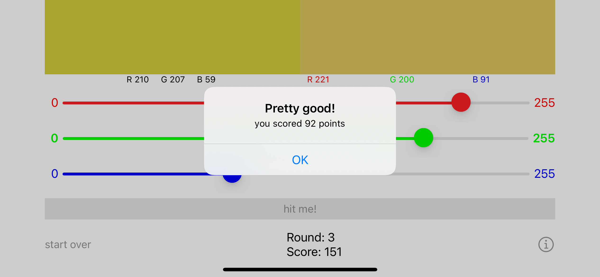
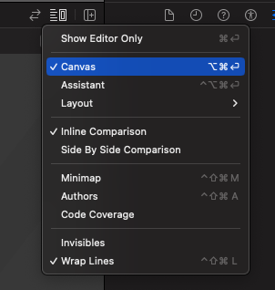
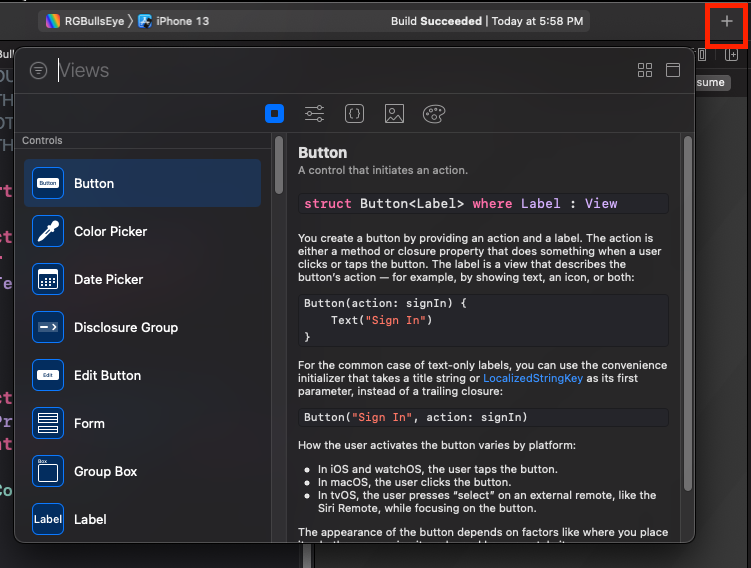
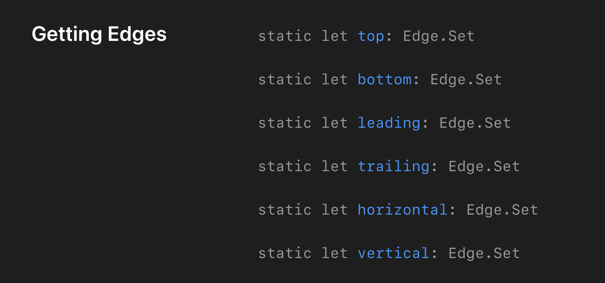
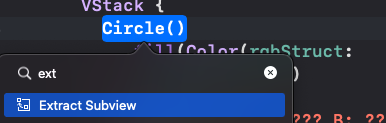

# Chapter2. Getting Started

실습해본것: https://github.com/cozzin/sui-materials/commit/c28f63d5306ecdb8a9970792613eec1b639db74b

## 이번 챕터에서 배울 것
- Xcode canvas
- 재사용가능한 slider 만들기
- `@State` property에 관해 배우기
- Alert 띄우기

## Getting started
- `UIKit/RGBullsEye` 시뮬에서 돌려보기
- 

## Exploring the SwiftUI starter project
- `SwiftUI/RGBullsEye`

```swift
@main
struct RGBullsEyeApp: App {
  var body: some Scene {
    WindowGroup {
      ContentView()
    }
  }
}
```

- `@main`: 앱 시작점
- [`App`](https://developer.apple.com/documentation/swiftui/app/): 
App을 conform하고 @main을 달아주면 [`App.main()`](https://developer.apple.com/documentation/swiftui/app/main()) static func을 호출해줌.
이 함수는 플랫폼에 적절하게 기본구현 되어 있음.
- `View`: 프로토콜. 구현할 떄 `struct`로 구현.

```swift
struct ContentView: View {
  var body: some View {
    Text("Hello, world!")
      .padding() // 상하좌우 기본 10 padding
  }
}
```

## Previewing your ContentView

```swift
struct ContentView_Previews : PreviewProvider {
  static var previews: some View {
    ContentView()
  }
}
```

- 
- Canvas: Option-Command-enter
- Resume: Option-Command-P

## Creating your UI

- SwiftUI는 선언적임(declarative)
- [선언형 프로그래밍 알아보기](https://medium.com/@hongseongho/%EC%84%A0%EC%96%B8%ED%98%95-%ED%94%84%EB%A1%9C%EA%B7%B8%EB%9E%98%EB%B0%8D-%EC%95%8C%EC%95%84%EB%B3%B4%EA%B8%B0-1d8247342f17)
- 가독성을 위해 많은 View를 만들도록 권장

## Some SwiftUI vocabulary

- Canvas and Minimap
- Modifiers: 변경을 위해서 UIKit처럼 property 세팅하는게 아니라 이걸 사용함.
- Container views: `HStack`, `VStack`, `ZStack`, `Group` 

우측 상단 + 버튼 눌러서 Library 보면, 이것저것 View를 볼 수 있음 (단축키: Command-Shift-L)

## Creating the target color view

- Command-Click > Embed in VStack
- Command-Shift-L > Color > Text 위에 놓기

## Creating the button and slider

- Command-Shift-L > Button
- Command-Shift-L > Slider

## Updating the UI

- SwiftUI에서는 `@State` property가 변경되면 body를 다시 그림. 
- View 안에서 사용하는 property

```swift
struct ContentView: View {
  @State var game = Game()
  @State var guess: RGB
  var target = RGB.random()
  // ...
}

struct ContentView_Previews: PreviewProvider {
  static var previews: some View {
    ContentView(guess: RGB(red: 0.8, green: 0.3, blue: 0.7)) // Preview에서 임시 데이터 넣어서 테스트 해보기 좋음
  }
}
```

## Making reusable views

### Making the red slider

```swift
HStack {
    Text("0")
    Slider(value: .constant(0.5))
    Text("255")
}
.padding(.horizontal) // padding에 넣는 값은 OptionSet으로 되어 있음
```

```swift
func padding(_ edges: Edge.Set = .all, _ length: CGFloat? = nil) -> some View
```



```swift
Slider(value: $guess.red)
    .tint(.red)
```

### Bindings

- `$` symbol에 대해 알아보기
- `guess.red`: read-only
- `$guess.red`: read-write
- 구체적인 설명이 없음. 뒤에서 더 설명할듯...

### Extracting subviews

- Command-click > Extract Subview
- Sub view로 쪼개서 재사용하기 아주 편함

### Live Preview

- Slider 변경할 떄 마다 `@State` property 변경해줌 = source of truth

## Presenting an alert

- (개인적인 생각) Alert, 화면전환 관리하는건 꽤나 불편함
- `@State` Bool 값으로 Alert show/dismiss 가능

```swift
.alert(isPresented: $showScore) {
  Alert(
    title: Text("Your Score"),
    message: Text(String(game.scoreRound)),
    dismissButton: .default(Text("OK")) {
      game.startNewRound()
      guess = RGB()
    })
}
```

### 꿀팁

- 라인 선택하고 `Option-Command-[`: 해당 라인 위로 이동 
- 라인 선택하고 `Option-Command-]`: 해당 라인 아래로 이동

## Making it prettier

별거아님. Circle로 더 깔끔하게 보여주기

```swift
Circle()
  .fill(Color(rgbStruct: game.target))
```

## Challenge: Create a ColorCircle subview

- Command-Click > Extract Subview



이런식으로 뽑아서 쓸 수 있음!

```swift
struct ColorCircle: View {
  let rgb: RGB
  
  var body: some View {
    Circle()
      .fill(Color(rgbStruct: rgb))
  }
}
```

그러면 사용하는 곳 가독성 굳
```
ColorCircle(rgb: game.target)
ColorCircle(rgb: guess)
```
