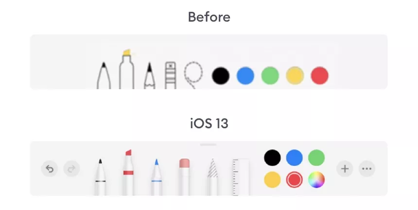
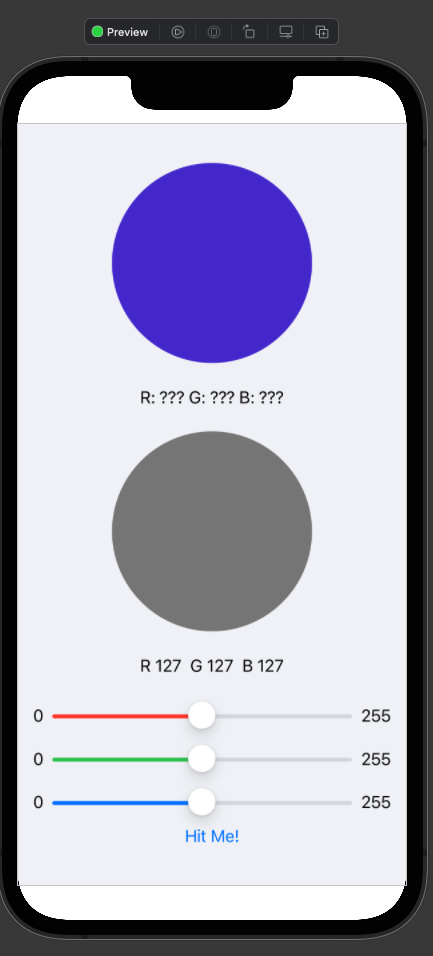
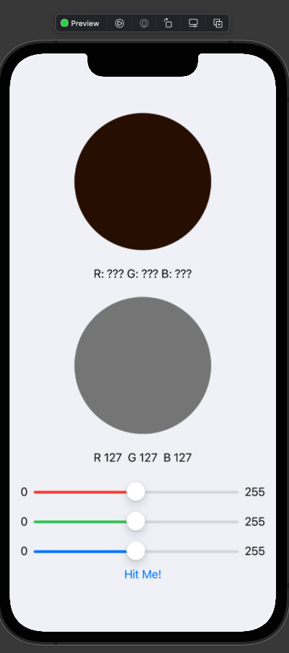
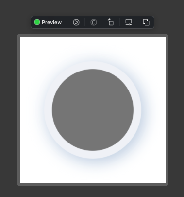
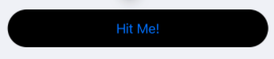
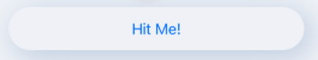
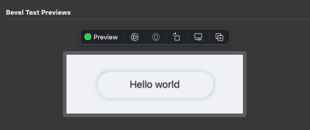
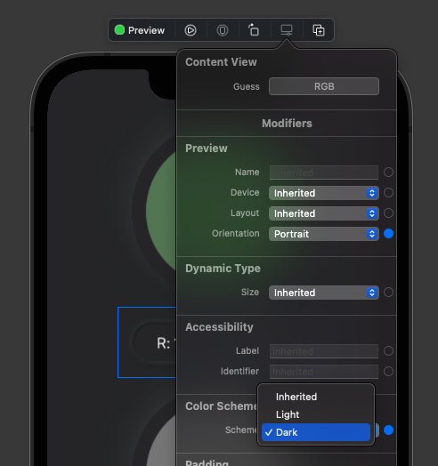
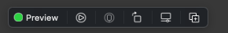

# Chapter3. Diving Deeper Into SwiftUI

실습 커밋: https://github.com/cozzin/sui-materials/commit/24d7070d74b0900b4ada7276c8f244e4be21609f

## Neumorphism
- highlights and shadows로 입체감 표현하는것

https://hype4.academy/articles/design/neumorphism-in-user-interfaces

## Colors for neumorphism
- Named Color 가져올 때 `Color.init(_ name: String, bundle: Bundle? = nil)`

```swift
static let element = Color("Element")
static let highlight = Color("Highlight")
static let shadow = Color("Shadow")
```

## Shadows for neumorphism

```swift
extension View {
  func northWestShadow(
    radius: CGFloat = 16,
    offset: CGFloat = 6
  ) -> some View {
    return self
      .shadow(
        color: .highlight, radius: radius, x: -offset,
          y: -offset) // 이런게 modifier
      .shadow(
        color: .shadow, radius: radius, x: offset, y: offset) // modifier chaning 해서 쓸 수 있음
  }
}
```

## Setting the background color

```swift
ZStack { // Z축 방향으로 element를 배치함
  Color.element // lower layer
  VStack {...} // higher layer
}
```

| Color.element | Color.element.ignoresSafeArea() |
| - | - |
|  |  |

> Note: ZStack에 ignoresSafeArea() 적용하면, content view들도 SafeArea 무시하게 됨

## Creating a neumorphic border

- Circle에 Border 만들기
- ZStack 안에 더 큰 Circle 하나 더 두면 됨

```swift
ZStack {
    // 작은 Circle
    Circle()
        .fill(Color.element)
        .northWestShadow()
    // 큰 Circle
    Circle()
        .fill(Color(red: rgb.red, green: rgb.green, blue: rgb.blue))
        .padding() // padding이 10이니까 이 크기로 Border 생김
}
```



## Order of modifiers

- modifiers 순서에 따라 View가 달라질 수 있음
- modifiers의 return Type이 primitive View가 아니라 `some View`인 경우 있음

```swift
Text(guess.intString)
  .lineLimit(0) // func lineLimit(_ number: Int?) -> some View
  .bold() // ❌ Text.bold() 사용불가: Value of type 'some View' has no member 'bold' 
```

```swift
Text(guess.intString)
  .bold() // func bold() -> Text
  .lineLimit(0) // func lineLimit(_ number: Int?) -> some View
```

## Creating a neumorphic button

```swift
.background(Capsule()) // 좌우 Corner인 직사각형 모양. 색깔은 까만색
```



```swift
.background(
    Capsule()
        .fill(Color.element) // 캡슐 색깔 지정
        .northWestShadow() // neumorphic
)
```



## Creating a custom button style

- `ButtonStyle`: 버튼 커스터마이징할 때 쓰면 좋음
```swift
struct NeuButtonStyle: ButtonStyle {
  let width: CGFloat
  let height: CGFloat

  // ButtonStyleConfiguration에는 
  // let label: ButtonStyleConfiguration.Label
  // let isPressed: Bool
  // 값이 있음

  func makeBody(configuration: Self.Configuration)
  -> some View {
    configuration.label
      .frame(width: width, height: height)
      .background(
        // ButtonStyle 적용하면 기본 visual feedback이 사라지는 단점이 있음
        // 버튼 터치했을 떄 visual feedback 추가해주기
        Group {
          if configuration.isPressed {
            Capsule()
              .fill(Color.element)
              .southEastShadow()
          } else {
            Capsule()
              .fill(Color.element)
              .northWestShadow()
          }
        }
      )
  }
}
```

## Creating a beveled edge

안쪽으로 파인것 처럼 보이게 하려면 이렇게

```swift
.background(
    ZStack {
        Capsule()
        .fill(Color.element)
        .northWestShadow(radius: 3, offset: 1)
        Capsule()
        .inset(by: 3)
        .fill(Color.element)
        .southEastShadow(radius: 1, offset: 1)
}
)
```



preview 사이즈 세팅

```swift
.frame(width: 300, height: 100)
.previewLayout(.sizeThatFits)
```

## “Debugging” dark mode



전체 앱을 다크모드로 적용하려면 시뮬에서 띄워야 함: Appearance ▸ Dark

preview에서 다크모드 세팅

```swift
.preferredColorScheme(.dark)
```

## Modifying font

```swift
.font(.headline)
```

- 상위 Container View에 적용하면 하위 Text들에 적용됨
- 그런데 하위 View에서 .font 지정되어 있으면 그걸 우선으로 따름

## Adapting to the device screen size

```swift
.previewDevice("iPhone 8")
```

### Getting screen size from GeometryReader

GeometryReader로 ContainerView의 크기 가져올 수 있음

```swift
GeometryReader { proxy in
    // ...
    width: proxy.size.width * labelWidth,
    height: proxy.size.height * labelHeight
```

## Previewing different devices



- 맨 오른쪽 버튼 누르면 Preview 복제해줌
- 다른 Device, 다른 크기, 다른 color Scheme 등으로 테스트 해보기 좋을 듯

