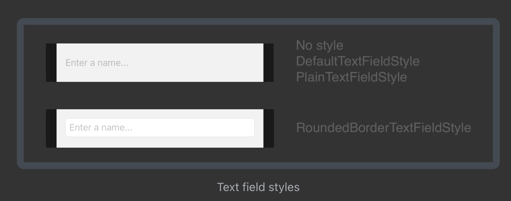
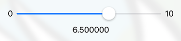
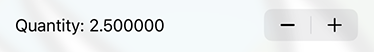
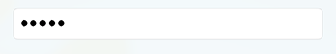

# Chapter 6. Controls & User Input

- `TextField`, `Button`, `Stepper` 이번 챕터에서는 이런거 배움 

## A bit of refactoring

- 파일로 분리해보기
- cmd+click > Extract Subview: subview struct로 분리해줌

## Power to the user: the TextField

- UITextField 처럼 텍스트 입력 받을 수 있는 컴포넌트
- text가 2 way binding 됨

```swift
@State var name: String = ""
```

```swift
TextField("Type your name...", text: $name)
```

## Styling the TextField

iOS에 기본 제공되는 스타일은 결국 2개 밖에 없는 것 같음



### 커스텀하게 스타일 적용할 방법 

1. `TextField`에 바로 modifier 조합해서 사용하기
2. `TextFieldStyle` conform 해서 스타일 만들기
3. custom modifier 만들기

### modifier 조합해서 사용하기

```swift
// `TextField`에 바로 modifier 조합해서 사용하기
TextField("Type your name...", text: $name)
    .padding(
        EdgeInsets(
            top: 8, leading: 16, bottom: 8, trailing: 16))
    .background(Color.white)
    .overlay(
        RoundedRectangle(cornerRadius: 8)
            .stroke(lineWidth: 2)
            .foregroundColor(.blue)
    )
    .shadow(
        color: Color.gray.opacity(0.4),
        radius: 3, x: 1, y: 2)
```

### custom text style 만들기

```swift
// TextFieldStyle은 이거 구현해주면 됨
// 근데 언더바 왜 있는걸까?
public func _body( 
  configuration: TextField<Self._Label>) -> some View
```

```swift
TextField("Type your name...", text: $name)
    .textFieldStyle(KuchiTextStyle())
```

### custom modifier 만들기

- 이게 가장 선호되는 방법
- 어떤 view라도 적용할 수 있기 때문

```swift
struct BorderedViewModifier: ViewModifier {
    func body(content: Content) -> some View {
        content
        // ... modifier들 사용하기 ...
    }
}
```

- 이걸 적용하려면 아래와 같이 쓰면 됨
- `ModifiedContent`도 `View` 타입

```swift
ModifiedContent(
  content: TextField("Type your name...", text: $name),
  modifier: BorderedViewModifier()
)
```

- ModifiedContent를 그대로 쓰면 chaining해서 쓰기도 어렵고, 가독성도 떨어짐.
- 그래서 extension으로 다음과 같은 함수를 만들면 좋음

## Keyboard and Form Tuning

```swift
.submitLabel(.done) // 키보드의 return 버튼 이름 바꾸기 
```

- 특정 control에 focus변경 하는 기능이 SwiftUI 3 부터 도입됨
- 이거 쓰려면 `Hashable` conform한 Type이 필요함

보통은 enum 사용하는게 자연스러움

```swift
enum Field: Hashable {
    case name
}
@FocusState var focusedField: Field?

var body: some View {
    TextField("Type your name...", text: $name)
        .focused($focusedField, equals: .name)
}
```

이 예제에서는 TextField가 하나라서 Bool만 써도 됨

```swift
@FocusState var nameFieldFocused: Bool

var body: some View {
    TextField("Type your name...", text: $name)
        .focused($nameFieldFocused)
}
```

## TextField’s initializer

```swift
public init<S>(
  _ title: S,
  text: Binding<String>,
  onEditingChanged: @escaping (Bool) -> Void = { _ in },
  onCommit: @escaping () -> Void = {}
) where S : StringProtocol
```

- `onEditingChanged`: focus 될 때/해제 될 때 호출됨
- `onCommit`: return key 누를 때 호출됨

```swift
public init<S, T>(
  _ title: S,
  value: Binding<T>,
  formatter: Formatter, // String이 아닌 값을 수정할 떄 사용 
  onEditingChanged: @escaping (Bool) -> Void = { _ in },
  onCommit: @escaping () -> Void = {}
) where S : StringProtocol
```

참고: [Data Formatting](apple.co/2MNqO7q)

## Taps and buttons

Button에 View를 담을 수 있음

```swift
struct Button<Label> where Label : View
```

```swift
init(
  action: @escaping () -> Void, // trigger handler
  @ViewBuilder label: () -> Label // button content
)
```

- action, trigger handler 라고 부르는 이유: 멀티 플랫폼 고려한 네이밍. iOS = tap, macOS = click, watchOS = digital crown press, ...
- action 클로저가 첫번째 parameter로 들어가는 부분: SwiftUI에서는 마지막 매개변수에 View 선언하는 패턴

### Submitting the form

```swift
Button(action: registerUser) {
  Text("OK")
}
```

```swift
// MARK: - Event Handlers
extension RegisterView {
  func registerUser() {
    print("Button triggered")
  }
}
```

`ObservableObject`: `@Published` 걸려있는 property가 변경되면 view update 트리거해줌
`@EnvironmentObject`: 상위 View에 environmentObject 주입하면, 하위 View에서 사용할 수 있음

```swift
@EnvironmentObject var userManager: UserManager
```

```swift
struct RegisterView_Previews: PreviewProvider {
    static let user = UserManager(name: "Ray")

    static var previews: some View {
        RegisterView()
            .environmentObject(user) // 이렇게 주입해주면 됨!
    }
}
```

### Styling the button

- SwiftUI 3.0 부터 `.buttonStyle(_:)` 사용 가능

### Reacting to input: validation

- 유저가 입력 중에 UI 반응하기
- UIKit에서는 `delegate`나 `Notification Center` 이벤트 subscribe해서 처리
- SwiftUI 방식은 다름. state를 변경시켜서 body가 다시 그려지게해서 반영

```swift
.disabled(!userManager.isUserNameValid())
```

## Toggle Control

`Toggle`: UISwitch 같은걸 표현해줌

```swift
public init(
    isOn: Binding<Bool>,
    @ViewBuilder label: () -> Label
)
```

## Handling the Focus and the Keyboard

앞에 나왔던 FocusState 사용하면 UX 개선할 수 있음

```swift
@FocusState var nameFieldFocused: Bool
```

```swift
TextField("Type your name...", text: $userManager.profile.name)
  .focused($nameFieldFocused)
  .submitLabel(.done)
  .onSubmit(registerUser) // 키보드에서 done 누를 때 registerUser() 호출
  .bordered()
```

```swift
func registerUser() {
  nameFieldFocused = false // 키보드 dismiss
  // ...
}
```

## Other controls

### Slider



```swift
public init<V>(
  value: Binding<V>, // binding할 값
  in bounds: ClosedRange<V>, // 범위
  step: V.Stride = 1, // step 사이의 interval
  onEditingChanged: @escaping (Bool) -> Void = { _ in } // editing 시작/끝 때 호출됨
) where V : BinaryFloatingPoint, V.Stride : BinaryFloatingPoint
```

### Stepper



```swift
public init<S, V>(
  _ title: S, // 보통 현재 값 보여줌
  value: Binding<V>, // biding할 값
  in bounds: ClosedRange<V>, // 범위
  step: V.Stride = 1, // step 사이의 interval
  onEditingChanged: @escaping (Bool) -> Void = { _ in } // editing 시작/끝 때 호출됨
) where S : StringProtocol, V : Strideable
```

### SecureField



## Key points

- View 리팩토링 & 재사용 하는 방법
- ViewModifier 만드는 방법
- 유저 입력 받으려면 `TextField` or `SecureField`
- UIKit/AppKit 보다 Button의 모습을 유연하게 만들 수 있음
- SwiftUI에서는 Input을 Validating 하는게 쉬움. state 변경되었을 때의 규칙만 잘 정해주면 됨
- toggles, sliders, steppers 등등 지원되어서 좋다고 함. (근데 당연히 지원되어야 할 것들로 보임)

추천영상: [SwiftUI Essentials](https://developer.apple.com/videos/play/wwdc2019/216/)