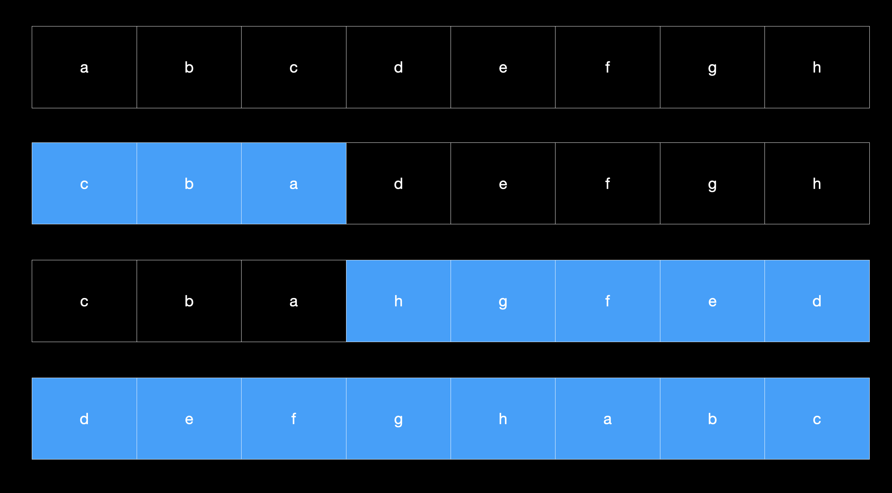

# 칼럼 2: 아하! 알고리즘

> "아하!"라는 영감은 꼭 깊은 연구를 통해서만 얻어지는 것이 아니다. 
> 코딩을 하기 전, 하는 중 그리고 하고 나서 진지하게 생각하려 한다면 어느 프로그래머나 얻을 수 있는 것이다. (p.33)

어떻게 보면 컴퓨터 앞에서만 작업이 이루어지는 것은 아닌 것 같다. 
잘 풀리지 않는 어려운 문제를 머릿속에 담아두었다가 어느정도 방향을 잡고서 코드를 작성하는 것이 좋다고 선배 개발자에게 배운적이 있다.

## 2.1 세 가지 문제
(문제의 상세한 조건은 생략되어 있음. 필요한 경우 p.34 참고)

* A. 파일에 포함되지 않은 임의의 32비트 정수 하나 찾기
* B. n개의 원소를 가지는 1차원 벡터를 i만큼 왼쪽으로 회전시켜라
* C. 주어진 영어단어 사전에서 전철어구(anagram) 집합을 모두 찾기

## 2.2 이진 탐색(Binary Search)
A번 문제 해법

https://tenor.com/view/binary-search-sequence-search-gif-20595028

양쪽 절반을 비교하여 적은 원소를 가진 범위에 빠진 원소가 있음을 알 수 있는 것이다. (p.37)

### 이진 탐색의 사용 예
* 이분법(bisection method): 변수가 하나인 방정식의 해를 찾을 때 사용
* 랜덤화된 이진 탐색 기법: 랜덤한 원소의 주위를 분할하고 그 원소를 중심으로 한쪽 방향에 있는 모든 원소들에 대해 재귀적인 동작을 하는 것
* 트리형 데이터 구조에도 사용됨
* 프로그램을 디버깅할 떄도 사용됨: 프로그램이 아무런 에러 메세지 없이 죽어버릴 떄, 소스 코드의 어느 구문이 원인인지를 어떻게 찾아낼 것인가?
  * 다음에 binary search 느낌으로 디버깅 해봐야겠다.

## 2.3 기초적인 조작의 위력

B번 문제 해법

### ab -> ba 벡터로 바꾸기

문제 보는 관점 바꾸기. 벡터 x를 회전시키는 것은 결국 ab의 두 부분을 맞바꾸어서 벡터 ba로 만드는 것이다.

### 반전 시키는 방법
(reverse 시키는 함수가 있다고 가정)

ab -> a^r b -> a^r b^r -> (a^r b^r)^r -> ba

## 2.4 정렬

...

## 2.5 원리

* 정렬: 시스템의 명세일 수도 있지만 다른 프로그램을 위한 준비 단계일 수도 있다.(이진 탐색의 경우가 그렇다.)
* 이진탐색: 정렬된 집합에서 원하는 원소 찾아내는 알고리즘. 
  * 매우 효율적.
  * 단점: 전체 집합을 미리 알고 있어야 함. 이미 정렬된 상태여야 함.
* 표시: 정렬을 한 후 같은 문자의 개수를 나타내는 것도 표시가 될 수 있다.
  * "Mississippi" -> "i4m1p2s4"

