# 스프링 입문 - 코드로 배우는 스프링 부트, 웹 MVC, DB 접근 기술

[https://www.inflearn.com/course/%EC%8A%A4%ED%94%84%EB%A7%81-%EC%9E%85%EB%AC%B8-%EC%8A%A4%ED%94%84%EB%A7%81%EB%B6%80%ED%8A%B8](https://www.inflearn.com/course/%EC%8A%A4%ED%94%84%EB%A7%81-%EC%9E%85%EB%AC%B8-%EC%8A%A4%ED%94%84%EB%A7%81%EB%B6%80%ED%8A%B8)

## intelliJ 단축키

- Cmd + Shift + Enter: 가장 적절한걸로 자동완성
- Option + Cmd + v: 함수의 결과를 담는 변수를 선언해줌
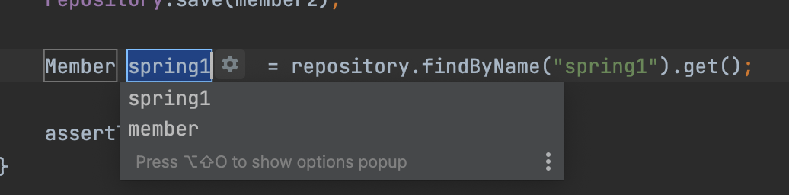
- Shift + F6: 변수명을 Refactor 할 수 있음
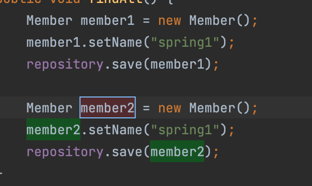
- `/**` 까지만 입력하고 Enter: Document comment 스니펫 만들어줌
 
- Control + T: 리팩토링 관련된 여러 기능 선택할 수 있음
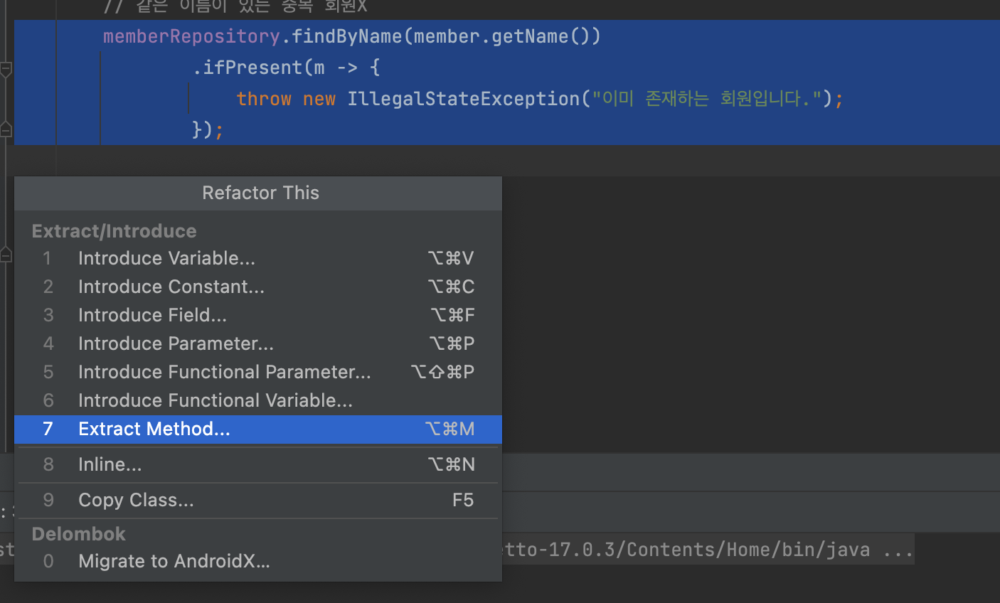 
- Cmd + Shift + T: 해당 클래스에 매칭되는 테스트 클래스 만들기


## 사소한 문제 해결

- [인텔리제이 Run 실행 안 될 때 해결 방법](https://ottl-seo.tistory.com/entry/%EC%9D%B8%ED%85%94%EB%A6%AC%EC%A0%9C%EC%9D%B4-Run-%EC%8B%A4%ED%96%89-%EC%95%88-%EB%90%A0-%EB%95%8C-%ED%95%B4%EA%B2%B0-%EB%B0%A9%EB%B2%95)

## 라이브러리 살펴보기

- spring-boot-starter-web
- spring-boot-starter(공통): 스프링 부트 + 스프링 코어 + 로깅

> SDK 만들때 spring 모듈 구조 참고해도 좋을 듯

## @ResponseBody 사용원리

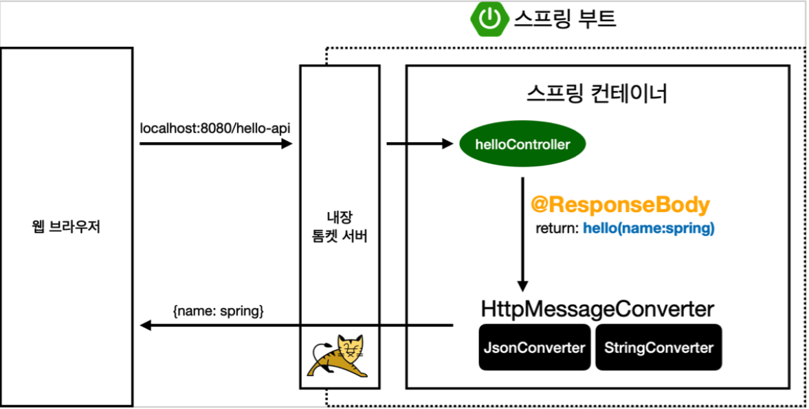

- ResponseBody, 템플릿 엔진 다 크게는 비슷한 흐름을 가진다
- Response Data들이 들어있는데 객체를 JSON으로 바꿔주는 annotation이 `@ResponseBody`.
- `@ResponseBody`가 걸려있으면, `HttpMessageConverter` 통해서 변환해준다. 굉장히 간편한 기능인듯!

## 회원 관리 예제 - 백엔드 개발

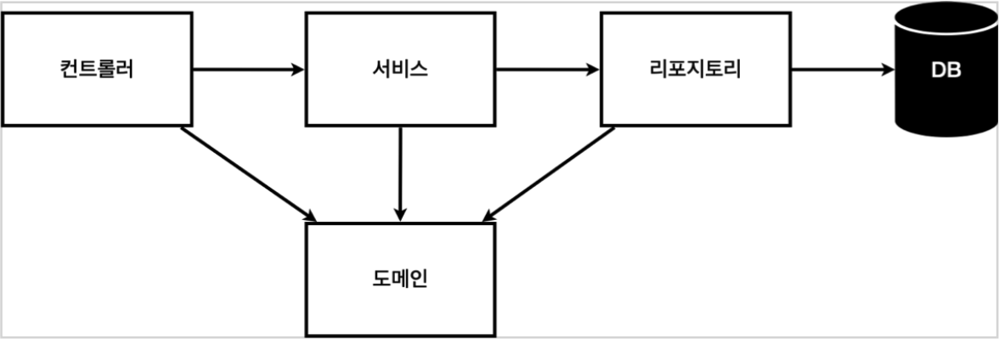

- 컨트롤러: 웹 MVC의 컨트롤러 역할
- 서비스: 핵심 비즈니스 로직 구현. 비즈니스에 의존적으로 설계함. 해당 비즈니스 용어로 유추할 수 있으면 좋음.
- 리포지토리: 데이터베이스에 접근, 도메인 객체를 DB에 저장하고 관리
- 도메인: 비즈니스 도메인 객체, 예) 회원, 주문, 쿠폰 등등 주로 데이터베이스에 저장하고 관리됨

> 도메인 레이어가 아직은 제대로 이해가 되지 않는다... DB에 저장하는 데이터를 객체로 만들어 둔걸로 보면 되는걸까?

## 회원 리포지토리 테스트 케이스 작성

- JUnit 사용

### @AfterEach
ios test의 tearDown과 같은 역할

```java
@AfterEach
public void afterEach() {
    repository.clearStore();
}
```

### @Test

테스트 클래스 인지 지정할 필요도 없이, function에 `@Test` annotation만 붙여주면 됨. 

> annotation을 어떻게 감지하는지, 커스텀하게 만들 수 있는건지도 찾아봐야 할 듯

```java
@Test
public void save() {
    Member member = new Member();
    member.setName("spring");

    repository.save(member);

    Member result = repository.findById(member.getId()).get();
    assertThat(member).isEqualTo(result);
}
```

### import static
```java
import static org.assertj.core.api.Assertions.*;
```

이런식으로 import static 해두면 사용하는 곳에서 패키지 지정없이 바로 쓸 수 있음

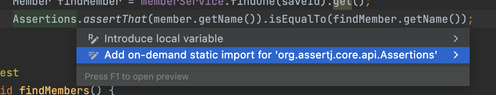

option + enter 해보면 static import로 변경해주는 항목이 뜸

### Dependency Injection

- Service가 Repository 객체를 의존하고 있는데 의존 관계를 드러나게 하고, 
테스트 환경에 따라 Repository를 교체해주기 위해서는 의존성 주입이 필요하다.
- cmd + n > constructor 사용하면 init으로 객체를 주입받을 수 있도록 IDE가 금방 만들어준다

```java
class MemberServiceTest {

    MemberService memberService;
    MemoryMemberRepository memberRepository;

    @BeforeEach
    public void beforeEach() {
        memberRepository = new MemoryMemberRepository();
        memberService = new MemberService(memberRepository); // Dependency Injection
    }
}
```

## 스프링 빈과 의존관계

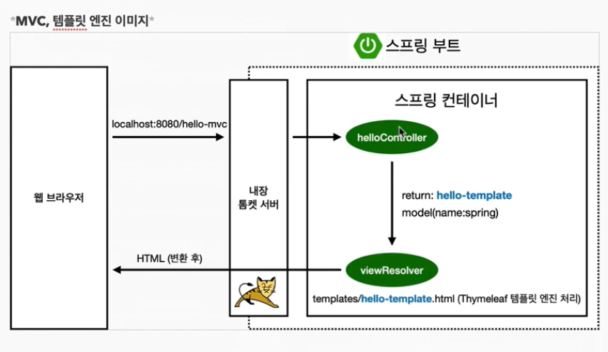

- `@Controller` 이런 스프링 관련 annotation이 붙어있으면, 스프링이 어떤 곳에 객체를 생성해서 관리함
- 이런걸 Bean Pattern이라고 함

```java
@Controller
public class MemberController {
    
    private final MemberService memberService = new MemberService();
}
```

- 이런식으로 바로 Controller에서 생성해주면 객체마다 Service를 생성하게 됨
- 그런데 service를 중복으로 생성할 필요 없는 경우에는 Spring Container에 등록해두고 가져오면 됨

### @Autowired

- Spring이 객체를 생성할 때 constructor를 호출할 텐데, 그때 `@Autowired`가 붙어있으면 파라미터를 Container에서 생성해서 주입해줌
- 예제에서는 Controller -> Service -> Repository 로 의존하고 있음

```java
@Controller
public class MemberController {

    private final MemberService memberService;
    
    @Autowired
    public MemberController(MemberService memberService) {
        this.memberService = memberService;
    }
}
```

```java
@Service
public class MemberService {

    private final MemberRepository memberRepository;

    @Autowired
    public MemberService(MemberRepository memberRepository) {
        this.memberRepository = memberRepository;
    }
}
```

```java
@Repository
public class MemoryMemberRepository implements MemberRepository
```


### 스프링 빈을 등록하는 2가지 방법
1. 컴포넌트 스캔과 자동 의존관계 설정
2. 자바 코드로 직접 스프링 빈 등록하기

### 컴포넌트 스캔과 자동 의존관계 설정

- `@Component` annotation이 있으면 스프링 빈으로 자동 등록됨
- `@Controller`, `@Service`, `@Repository` 안에 까보면 `@Component`라고 되어 있음
- 스프링 빈을 등록할 때 기본으로 싱글톤으로 등록. 설정으로 싱글톤이 아니게 할 수 있음. 특별한 경우가 아니면 싱글톤 사용

### 의존성 주입

- 생성자 주입
- 필드 주입
- setter 주입

생성자 주입이 제일 좋음! 의존 관계가 실행중에 동적으로 변경되는 경우가 거의 없음

## 스프링 DB 접근 기술

### h2 데이터베이스 설치

h2 > bin > h2.sh 실행하면 다음과 같은 로그인 창이 뜬다
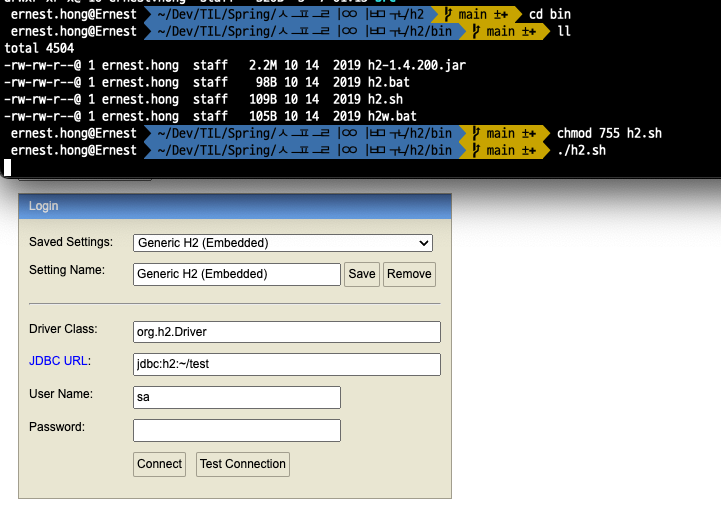

루트로 가보면 `test.mv.db`가 생성되어 있음! 이게 있어야 한다고 함
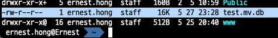

- 애플리케이션과 웹콘솔이 동시에 접근하는 경우 오류가 날 수 있음
- 그래서 JDBC URL을 다음과 같이 설정하고 사용: 파일을 직접 접근하는게 아니라 소켓을 통해서 접근
```
jdbc:h2:tcp://localhost/~/test
```

```
drop table if exists member CASCADE; # 기존에 member 테이블이 존재한다면 지워주기
create table member
(
    id   bigint generated by default as identity, # java에서는 Long인데, db에서는 bigint 사용. id값을 안넣어주면 자동으로 생성됨
    name varchar(255),
    primary key (id)
);
```

insert 해보기
```
insert into member(name) values('spring1');
```

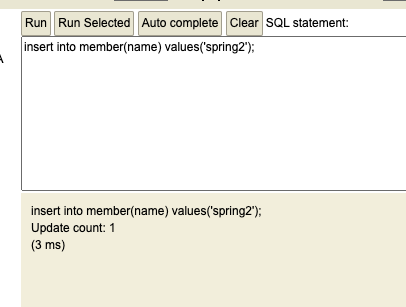

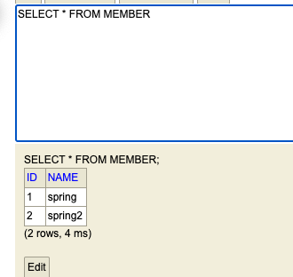

영한님은 sql을 파일로 추가해두는 편이라고 하심. 이렇게 하면 git으로 관리되어서 나중에 파악하기에 좋음

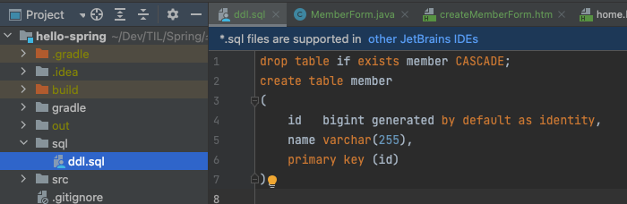

### 순수 JDBC

#### org.h2.jdbc.JdbcSQLInvalidAuthorizationSpecException 에러
- `org.h2.jdbc.JdbcSQLInvalidAuthorizationSpecException: Wrong user name or password [28000-200]` 에러가 뜨는데
[https://www.inflearn.com/questions/94189](https://www.inflearn.com/questions/94189) 여기보면 안내가 나와있음
- 스프링부트 2.4부터는 `spring.datasource.username=sa`를 꼭 추가해주어야 한다. 그렇지 않으면 `Wrong user name or password` 오류가 발생한다.
- 이걸 application.properties 에 추가하기

#### 개방-폐쇄 원칙

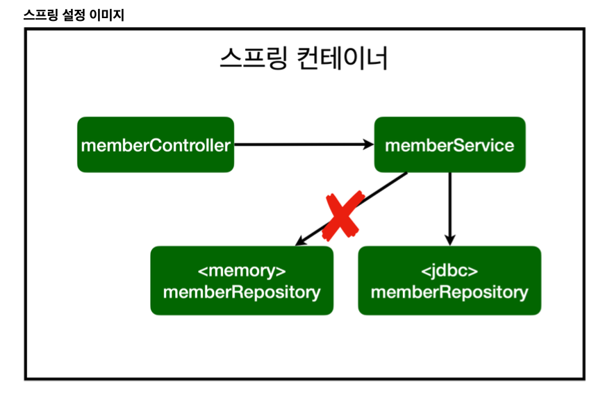

- OCP 확장에는 열려있고, 변경에는 닫혀있다.
- 다형성 개념을 활용해서 기능을 완전히 변경해도, 애플리케이션 코드를 수정하지 않아도 됨
- Memeory -> JDBC Repository 변경했지만 다른 부분은 수정하지 않았음

### 스프링 통합 테스트

- 테스트 class에 `@SpringBootTest` 걸어두면 스프링 컨테이너를 함께 띄워서 테스트 해볼 수 있음
- constructor로 의존성 주입 받으면 좋지만 테스트에서는 간단하게 프로퍼티에 `@Autowired` 걸어서 사용
- DB를 변경한게 커밋되면 다음 테스트에도 영향을 줄 수 있기 때문에 class에 `@Transcational` 걸어두면 테스트 케이스마다 롤백함. 서비스 코드에 쓰면 롤백하지 않고 정상적으로 작동함.
  - 실제로 DB에 commit 되게하고 싶으면 method에 `@Commit` 붙이면 됨

- 통합테스트: DB까지 연동해서 테스트
- 단위테스트: 스프링 컨테이너 없이 최소 단위로 테스트. 이걸 잘만들어두는게 좋음!

### 스프링 JdbcTemplate
- 앞선 순수 JDBC에서 반복적으로 수행하던 작업을 간단하게 처리해줌
- sql은 여전히 작성해야 함

### JPA

application.properties

```
spring.jpa.show-sql=true # jpa가 날리는 sql을 볼 수 있음
spring.jpa.hibernate.ddl-auto=none # jpa를 사용하면 객체를 보고 테이블도 만들어주는데, 지금은 테이블 만들어져 있는 상태라서 none으로 설정함
```

### 스프링 데이터 JPA

- JPA를 먼저 배우고 스프링 데이터 JPA를 배워야 함
- 인터페이스만으로 마법처럼 구현가능

이것만 만들면 끝이라고...?!

```java
public interface SpringDataJpaMemberRepository extends JpaRepository<Member, Long>, MemberRepository {

    @Override
    Optional<Member> findByName(String name);
}
```

- Spring DATA JPA가 JpaRepository를 구현하고 있는 클래스를 Spring에 알아서 등록해줌 (프록시라는 기술이 있다고 함)
- (내생각) 불편한 것들을 자동으로 해준다는 점에서 좋지만, 의존 관계가 생략되고 어떤 곳에서 제어하는지 확인하기 어려운게 아쉽다

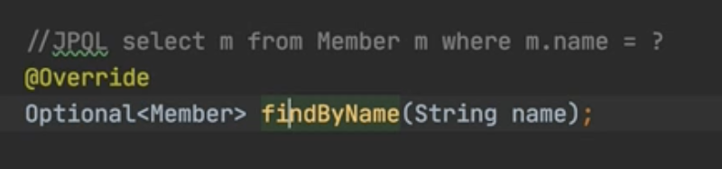
- method 네이밍에 따라서 sql을 작성할 수 있음 (리플렉션)
- 단순한 작업은 인터페이스만으로 개발이 끝나는 효과가 있음

## AOP

### AOP가 필요한 상황

- 모든 메소드의 호출 시간을 측정하고 싶다면? 
- 공통 관심 사항(cross-cutting concern) vs 핵심 관심 사항(core concern)

이런식으로 시간 측정 로직을 넣을 수는 있음

```java
public List<Member> findMembers() {
    long start = System.currentTimeMillis();

    try {
        return memberRepository.findAll();
    } finally {
        long finish = System.currentTimeMillis();
        long timeMs = finish - start;
        System.out.println("findMembers = " + timeMs + "ms");
    }
}
```

- 하지만 시간 측정 기능은 기존 기능의 핵심 부분은 아님
- 시간 측정 들어감으로 유지보수가 어려우짐;;
- 시간 측정 로직을 변경할 때 모든 로직을 찾아가면서 변경해야 한다...

> 핵심 로직보다 다른 로직들이 더 많은 경우, 코드 전반에 퍼져 있는 것이 많은데 잘 참고해봐야 겠다

## AOP 적용

- AOP: Aspect Oriented Programming
- 공통 관심 사항(cross-cutting concern) / 핵심 관심 사항(core concern) 분리

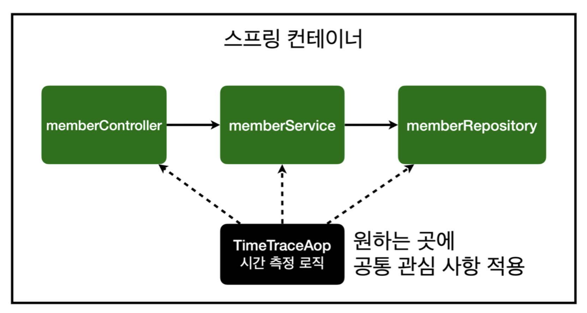

와...... 그냥 원하는 곳에 지정만 해주면 됨...

```java
@Aspect // AOP 사용
@Component // Bean에 등록
public class TimeTraceAop {

    @Around("execution(* hello.hellospring..*(..))") // AOP 적용할 타겟 지정
    public Object execute(ProceedingJoinPoint joinPoint) throws Throwable {
        long start = System.currentTimeMillis();
        System.out.println("START: " + joinPoint.toString());
        try {
            return joinPoint.proceed();
        } finally {
            long finish = System.currentTimeMillis();
            long timeMs = finish - start;
            System.out.println("END: " + joinPoint.toString() + " " + timeMs + "ms");
        }
    }
}
```

- 중간에 프록시 객체를 둬서 이런일이 가능하게 함
- 가짜 spring bean 을 먼저 호출해줌

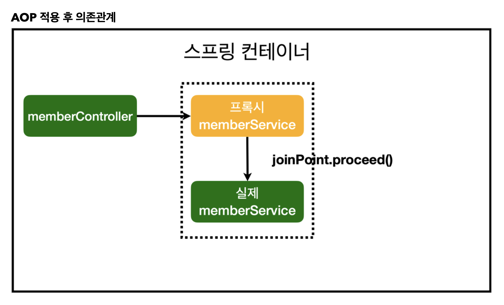

